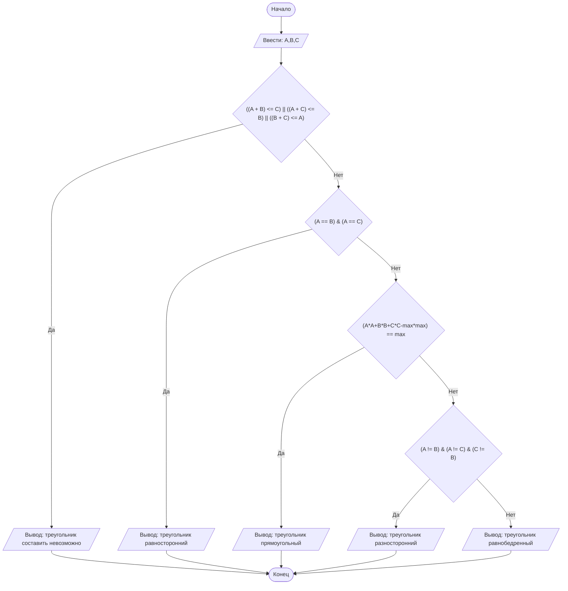

## Отчет по лабораторной работе № 1

#### № группы: `ПМ-2402`

#### Выполнила: `Каменева Алина Дмитриевна`

#### Вариант: `10`

### Cодержание:

- [Постановка задачи](#1-постановка-задачи)
- [Входные и выходные данные](#2-входные-и-выходные-данные)
- [Выбор структуры данных](#3-выбор-структуры-данных)
- [Алгоритм](#4-алгоритм)
- [Программа](#5-программа)
- [Анализ правильности решения](#6-анализ-правильности-решения)

### 1. Постановка задачи

> Три отрезка длиной A, B и C пытаются образовать треугольник.
> Проверить, возможно ли составить треугольник из этих отрезков, и если да, то
> определить, какой это треугольник: равносторонний, равнобедренный, разносторонний или прямоугольный.
> На вход программы подаются натуральные числа A, B, C.

Данную задачу можно разделить на 2 подзадачи: 1) возможно ли, используя введенные числа, составить треугольник 2) если да, то определить его тип

- Для 1 подзадачи нужно рассмотреть 3 случая:
  1. `(A+B)<=C` (если сумма 1 и 2 стороны не больше 3 стороны)
  2. `(A+C)<=B` (если сумма 1 и 3 стороны не больше 2 стороны)
  3. `(B+C)<=A` (если сумма 3 и 2 стороны не больше 1 стороны)
- Если ни одно из условий 1 подзадачи не выполняется, то треугольник составить возможно, тогда для 2 подзадачи нужно также рассмотреть 4 случая:
  1. `A = B = C` (тип треугольника: равносторонний)
  2. `A != B != C` (тип треугольника: разносторонний)
  3. `sqrt(A*A+B*B+C*C-max*max) == max`(тип треугольника:прямоугольный)
  4. `(A == n2) != n3 или (A = n3) != n2 или A != (n2 == n3)` (тип треугольника: равнобедренный)

### 2. Входные и выходные данные

#### Данные на вход

На вход программа должна получать 3 натуральных числа. Верхняя и нижняя границы получаемых
чисел не даны в условии.

|             | Тип               |
| ----------- | ----------------- |
| A (Число 1) | Натуральное число |
| B (Число 2) | Натуральное число |
| C (Число 3) | Натуральное число |

#### Данные на выход

Т.к. программа требует определить, возможно ли образовать треугольник и если да, то вывести его тип, то в выводе строковый ответ на вопрос

| Тип    |
| ------ |
| Строка |

### 3. Выбор структуры данных

Программа получает 3 натуральных числа. Поэтому для их хранения
можно выделить 3 переменных (`A`, `B` и `C`) типа `int`.

|             | название переменной | Тип (в Java) |
| ----------- | ------------------- | ------------ |
| A (Число 1) | `A`                 | `int`        |
| B (Число 2) | `B`                 | `int`        |
| C (Число 2) | `C`                 | `int`        |

### 4. Алгоритм

#### Алгоритм выполнения программы:

1. **Ввод данных:**  
   Программа считывает два целых числа, обозначенные как `A`, `B` и `C`.

2. **Сравнение чисел:**  
   Программа проверяет заданные числа на условие несуществования треугольника. Если оно выполняется, программа выводит ответ о том, что треугольник составить невозможно.
   Если условие не выполняется, то программа далее проверяет числа на соответветсвие одному из типов треугольников.

3. **Вывод результата:**  
   На экран выводится либо тип треугольника, либо то, что треугольник составить невозможно.

#### Блок-схема



### 5. Программа

```java
import java.io.PrintStream;
import java.util.Scanner;

public class Main {
    // Объявляем объект класса Scanner для ввода данных
    public static Scanner in = new Scanner(System.in);
    // Объявляем объект класса PrintStream для вывода данных
    public static PrintStream out = System.out;
    public static void main(String[] args)
        // Считывание трех целых чисел A,B и C из консоли {
        int A = in.nextInt(), B = in.nextInt(), C = in.nextInt();
        boolean b = true; // задание переменной типа bool, чтобы в дальнейшем проверять условия через логические операции
        int max = 0; // задание переменной типа int, поиск максимума, чтобы упростить вычисления в дальнейшем
        if ((A>B) && (A>C)) // если А больше B и C, то переменной max присваивается значение переменной A
            max = A;
        else if (B>C) // если первая проверка не верна, то проверяется не больше ли значение B значения C, в таком случае переменной max присваевается значение переменной B
            max = B;
        else max = C; // иначе переменной max присваивается значение переменной C
        if ((((A + B) <= C) || ((A + C) <= B) || ((B + C) <= A)) == b) //проверка условия на несуществования треугольника по заданным числам
            out.print("треугольник составить невозможно");
        else     // если треугольник существует
            if (((A == B) && (A == C)) == b) // проверка не равны ли его стороны друг другу
                out.print("треугольник равносторонний"); // если равны, то вывод на экран "треугольник равносторонний"
            else if (Math.sqrt(A*A+B*B+C*C-max*max) == max) // иначе проверка на то, не является ли треугольник прямым
                    out.print("треугольник прямоугольный"); // если условие выполняется, то вывод на экран "треугольник прямоугольный"
            else if (((A != B) && (A != C) && (C != B)) == b) // иначе проверка на то, не различны ли все стороны треугольника
                        out.print("треугольник разносторонний"); // если условие выполняется, то вывод на экран "треугольник разносторонний"
            else
                out.print("треугольник равнобедренный"); // иначе вывод на экран "треугольник равнобедренный"
    }
}

```

### 6. Анализ правильности решения

Программа работает корректно на всем множестве решений.

1. Тест на `треугольник составить невозможно`:

   - **Input**:

     ```
     22 5 8
     ```

   - **Output**:
     ```
     треугольник составить невозможно
     ```

2. Тест на `треугольник прямоугольный`:

   - **Input**:

     ```
     3 4 5
     ```

   - **Output**:
     ```
     треугольник прямоугольный
     ```

3. Тест на `треугольник равносторонний`:

   - **Input**:

     ```
     6 6 6
     ```

   - **Output**:
     ```
     треугольник равносторонний
     ```

4. Тест на `треугольник разносторонний`:

   - **Input**:

     ```
     7 8 10
     ```

   - **Output**:
     ```
     треугольник разносторонний
     ```

5. Тест на `треугольник равнобедренный`:

   - **Input**:

     ```
     5 5 7
     ```

   - **Output**:
     ```
     треугольник равнобедренный
     ```
